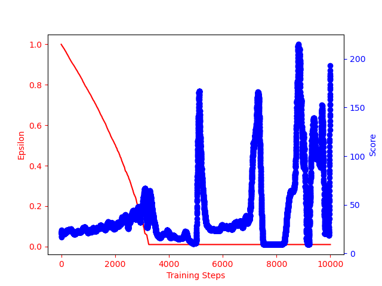

# Naive DQN Solution Implementation of Cart Pole environment from OpenAI's gym

## Agent with Neural Network for Q function approximation

The Neural Network is a simple feed forward neural network consisting of only the input layer and the output layer which acts as a function approximator for the Q-value of the state-action pairs. We can see the trend in the graph below that as the $\epsilon$ value decreases, the performance of the agent also increases but in a stochastic manner. As the epsilon value decreases, the agent becomes more and more greedy and hence the performance of the agent increases. When the epsilon value plateaus, the agent's performance fluctuates between the two extremes indicating that the naive DQN is not approximating the Q-value of the state-action pairs well.

